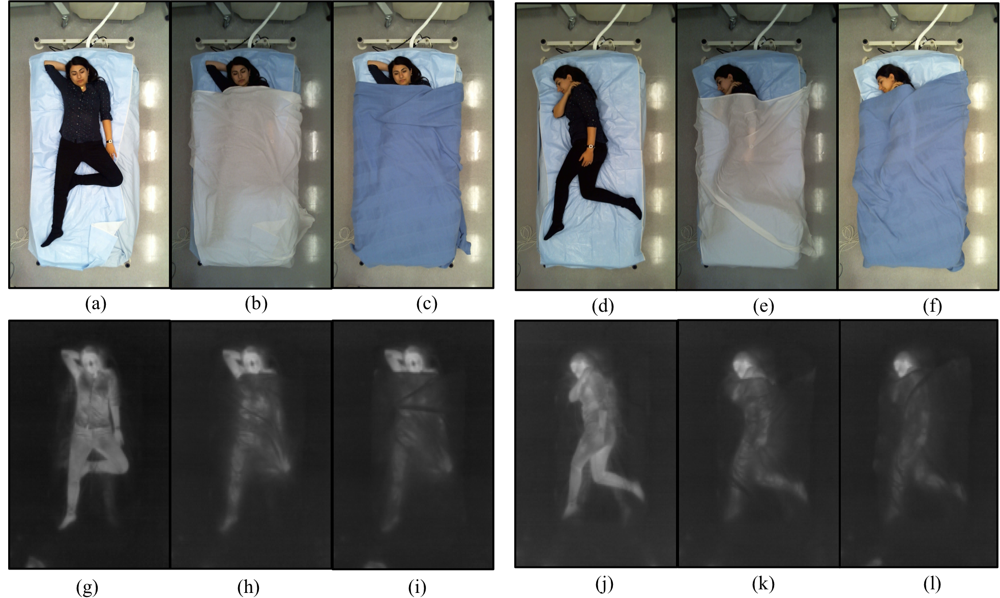

# Stacked Hourglass Networks for Human Pose on SLP 

This is the training pipeline used for:
Shuangjun Liu, Sarah Ostadabbas, 
**Seeing Under the Cover: A Physics Guided Learning
Approach for In-Bed Pose Estimation?**,
[arXiv.1907.02161](https://arxiv.org/abs/1907.02161), MICCAI, 2019.

In this work, we employ [stacked hourglass](https://github.com/princeton-vl/pose-hg-train) to demonstrate Under the Cover Imaging via Thermal Diffusion (UCITD) via training on our sleep dataset (SLP). We interfaced our SLP dataset to original work to facilitate the training and testing process. Also 

A pretrained model under home settings under all cover conditions are [provided](http://www.coe.neu.edu/Research/AClab/SLP). 

## Preparation 
This code is emplemented on Torch7, 
to run this code, make sure the following are installed:

- [Torch7](https://github.com/torch/torch7)
- hdf5
- cudnn

Download SLP dataset from our project (website)[https://web.northeastern.edu/ostadabbas/2019/06/27/multimodal-in-bed-pose-estimation/]

Download this repository. In opts.lua, there are several key parameters need to be taken care of including: 

- dataset,  SLP  
- PMLab, 	danaLab (for home setting) | simLab (for hospital setting) 
- dataDir,  path/to/SLP 
- expDIR, 	where results and trained model will be saved here. 
- if_SLPRGB, if is the RGB modality otherwise, IR data will be loaded. 

## Running the Pose estimation  
Original work employs expID option to distinguish different experiments. However, we implemented an auto-naming mechanism. After setting the corresponding parameters, expID will be generated automatically. This includes the cover conditons, the modality emplyed and also if fine tuning is employed. Test result is also auto named. 

### Naming rule ###

for trained model 

expDir/SLP/labNm[simLab|danaLab]/cov[RGB]-[u,1,2]

for testing result 

expDir/SLP/labNm[simLab|danaLab]/cov[RGB]-[u,1,2]/ `[model employed]_[cover cases]`

### Basic command (options can be added accordingly) ###

** Training **

To train from scrath 
`th main.lua` 

To continue
`th main.lua continue`

** Testing **
`th main.lua -branch path/to/trained/model -finalPredictions -nEpochs 0` 

You can specify which section of the data is employed for training and which section for testing by setting `idx_subTest_SLP`, `idx_subTrain_SLP`, with {idxStart, idxEnd} format.  

To use pretrained hourglass, please download the [model](http://www-personal.umich.edu/~alnewell/pose/umich-stacked-hourglass.zip) first. Then use command 
`th main.lua -loadModel path/to/pretrained/model -finalPredictions -nEpochs 0`  

### Options ###
To change cover conditions,  please change the option `-converNms`. Please feed in cover options in a string separated with space for example, `-coverNms 'cover1 cover2 uncover'`  
To change modalities,  use `-if_SLPRGB`.  

The training and testing data can be also controlled with `-idx_subTest_SLP` and `-idx_subTrain_SLP` with syntax `-idx_sub[Test|Train]_SLP '<idx_start> <idx_end>'` to indicates which subjects ares used for test/train.

To fine tune last layer give fine tune name by  `-ftNm`. In the paper, we didn't use the fine tunning one as our dataset is large enough to support large scale network training. 

These options are both effective for training and testing. So you can easily configure cross modality and cross setting test to check how modalities and cover affect the modal performance. For example, you can easily use model trained on uncovered IR on thick covered RGB data by with provided options.  

Limited by space in original paper, not all possibly combinations result is provided. Users can further explore with provided tool to see how modality and cover conditions affect the model performance. 
 
### PCK plot ###

We provide exact script used in paper for PCK plot generation. `drawCrossEval.lua`. 
You need to set the tsLs to include all the experiment result you want to show in this plot.  
Also , set legends accordingly for each of the test.  Result will be shown and saved in pdf format.  

### video processing ###

We also provide a script for video processing,  `s_genSkelVid.lua`. You need to specify the video you want to process as vidNm in the script.  To run, 
`th s_genSkelVid.lua -branch datasetPM/danaLab/umich-stacked-hourglass-ftLast--cov-u12 -finalPredictions` 

## Acknowledgements ##

This pipeline is largely built on original stacked hourglass code available at 
[https://github.com/princeton-vl/pose-hg-train](https://github.com/princeton-vl/pose-hg-train)
